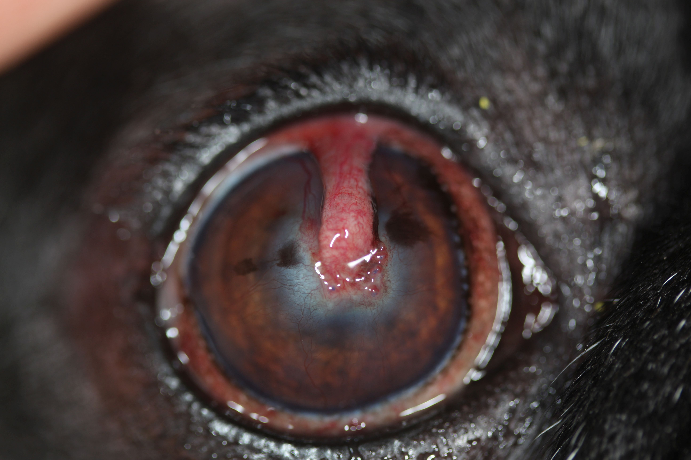

<!--

author:   Dr. Sabine Sahr
email:    Tierauge@gmail.com
version:  1.0.0
language: de
voice:    Deutsch Female
logo:     https://tieraugen.doctor/assets/images/spaltlampe.jpg
date:     22.03. 2024

@style
.lia-responsive-voice  {
    display: none;
}
@end

-->

# Klinische Fälle

## 1. Karli, Mischling, männlich, 6 Jahre

      {{1}}
*******************************************************
Wie lautet Ihre Diagnose?

[(A)] __A:__  mitteltiefes Ulcus corneae
[(B)] __B:__  tiefes einschmelzendes Ulcus corneae
[(C)] __C:__  Keratitis pigmentosa
*************************************************

### Therapie

__Notfalltherapie:__

- Kollagenlinse,
- Doppelantibiose lokal und systemisch mind. 6x tgl.,
- Atropin,
- antikollagenolytische Therapie (ACC, Amnionaugentropfen),
- Analgesie

      {{1}}
*******************************************************
__Sofortiges chirurgisches Eingreifen eine Option?__

JA aber.....

*************************************************

      {{2}}
*******************************************************
__Nun doch OP aber...__

*************************************************

      {{3}}
*******************************************************
__Karlis Auge nach 1 Monat__

*************************************************

      {{4}}
> __Abschließend:__
>
> über längeren Zeitraum aufklarende Therapie zB kortisonhaltige und ciclosporinhalte Augenmedis, Flapstieldurchtrennung

## 2. Mops Barrak, 14 Jahre, Tierschutz

      {{1}}
*******************************************************
Wie tief ist das Ulcus?

[(A)] __A:__  Descemetocele
[(B)] __B:__  tief stromales Ulcus
[(C)] __C:__  perforiertes Ulcus
*************************************************

### Therapie und Verlauf

Kostenrestriktion, deshalb konservativer Therapieversuch

__lokal:__

- AmnionAT 3x tgl,
- antibiotische Tropfen 4x tgl,
- AtropinAT 1x tgl,
- Hyaluron,
- VitaminA

__systemisch:__ Doxycyclin, Carprofen

      {{1}}
*******************************************************
__Halskragen__

*****************************************

## 3. Französische Bulldogge, Eddy, 6 Jahre

      {{1}}
*******************************************************
Was ist zu sehen?

[(A)] __A:__  SCCED?
[(B)] __B:__  oberflächliche Hornhautulcera?
[(C)] __C:__  einschmelzende Hornhautulcera?
*****************************************

### Therapie und Verlauf

__lokal:__

- Kollagenkontaktlinse,
- antibiotische Augentropfen hochfrequent,
- Atropin,
- Hyaluron,
- VitaminA

__systemisch:__ Antibiose bereits angefangen vom HTA Amox/Clav, Carprofen

      {{1}}
*******************************************************
__Halskragen__

*****************************************

## 4. Französische Bulldogge, 8 Jahre, Charly

      {{1}}
*******************************************************
Was ist hier zu sehen?

[(A)] __A:__  ein tiefes infiziertes Ulcus mit Perforationsgefahr?
[(B)] __B:__  ein oberflächlicher Defekt in überschießender Heilung?
[(C)] __C:__  eine chronisch, immun mediierte Keratitis?
******************************************

### Weiteres Vorgehen

In diesem Stadium bereits mit Ciclosporin lokal starten, engmaschige Heilungskontrollen, nach Heilung direkt mit lokalen kortisonhaltigen Augentropfen starten (Risiko starker Narbenbildung)

## 5. Französische Bulldogge Eddi, 4 Jahre

      {{1}}
*******************************************************
Wie ist das Ulcus zu beurteilen?

[(A)] __A:__  oberflächlich, unkompliziert
[(B)] __B:__  oberflächlich mit Hinweisen auf Infektion
[(C)] __C:__  tief und kompliziert
*****************************************

## 6. Boxer, 9 Jahre

      {{1}}
*******************************************************
Wie lautet die Diagnose?

[(A)] __A:__  Endotheldystrophie?
[(B)] __B:__  Hornhauterosion, unkompliziert?
[(C)] __C:__  SCCED?
*****************************************

### Verlauf

## 7. Yorkshire Terrier Fred, 9 Jahre

      {{1}}
*******************************************************
Welche Diagnosen kann man an der Hornhaut stellen?

[(A)] __A:__  SCCED
[(B)] __B:__  Hornhautfremdkörper mit Vaskularisation der Hornhaut
[(C)] __C:__  chronische Keratitis
******************************************

## 8. Perser Garfield, 1,5 Jahre

      {{1}}
*******************************************************
Was ist an der Hornhaut zu sehen?

[(A)] __A:__ Neoplasie?
[(B)] __B:__ Hornhautfremdkörper?
[(C)] __C:__ Sequester/ Cornea nigra?
*******************************************************

### Therapie

- in diesem Fall konservativer Versuch aufgrund des Hornhautbefundes und der Unkooperativität der Katze
- sporadische Gaben von Remend möglich
- systemische Antibiose und Analgesie
- Halskragen unmöglich

### Verlauf

## 9. Hund Whisky

      {{1}}
*******************************************************
Welche Zusatzuntersuchung würden Sie bei diesem Hund durchführen?

[(A)] __A:__  Gonioskopie
[(B)] __B:__  Schirmer Tränentest
[(C)] __C:__  Seidel Probe
*******************************************************

### Verlauf

## 10. Französische Bulldogge, 6 Jahre

      {{1}}
*******************************************************
Diagnose?

[(A)] __A:__  Uveitis anterior
[(B)] __B:__  Endotheldystrophie
[(C)] __C:__  SCCED
*******************************************************

### Verlauf nach 8 Tagen

## 11. Chihuahua Luigi, 12 Jahre

      {{1}}
*******************************************************
Welche Art Ulkus sehe ich?

[(A)] __A:__  Oberfl. Hornhauterosion?
[(B)] __B:__  Ensenile endotheliale Hornhautdystrophie?
[(C)] __C:__  Tiefstromales Hornhautulkus?
*******************************************************

### Therapie

Syst. Doxycyclin; NSAID
Lokal: antibiot. AT (5x); Atropin-AT 1x, Vetrix-AT: 3x; Remend-AT: 2x, Vit A Vision-AS: 1x abends
Halskrause 14 Tage

__3 Wochen__

## 12. Französische Bulldogge Tupac, 5 Jahre

      {{1}}
*******************************************************
Wie tief ist das Ulcus?

[(A)] __A:__  Oberfl. Hornhauterosion?
[(B)] __B:__  tief stromal
[(C)] __C:__  Descemetocele
*****************************

### Verlauf

Tx: Flap; lokale Tx mit antibiot. AT; Atropin 1x; Remend-AT; 2x, Vitagel: 2x;

7 Tage NSAID p.o.;  Amox/Clav: 6 Tage 2x täägl. P.o.
Halskrause 14 Tage

      {{1}}

